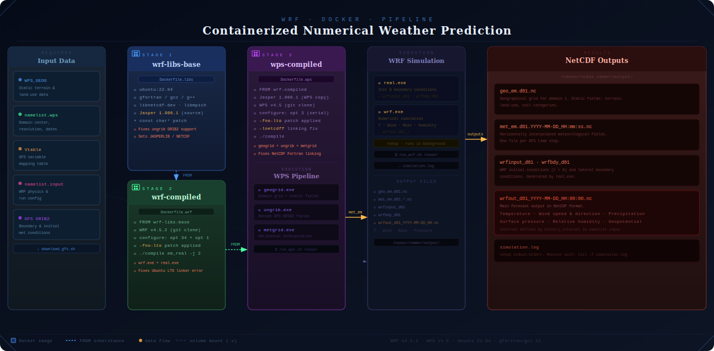

# WRF-Docker Pipeline

**Automated Weather Research and Forecasting (WRF) System Infrastructure for containerized HPC environments.**

This repository provides a fully reproducible Docker-based pipeline to compile and run [WRF v4.5.2](https://github.com/wrf-model/WRF) and [WPS v4.5](https://github.com/wrf-model/WPS) on any Linux host. It handles complex library dependencies (Jasper, NetCDF), automatic GFS boundary data download, and a clean step-by-step execution pipeline — so that researchers worldwide can run numerical weather prediction without manual compilation headaches.

---

## Pipeline



---

## Repository Structure

```text
gcp-wrf-infrastructure/
├── Dockerfile.libs                   # Stage 1: base libraries (Jasper, NetCDF, compilers)
├── Dockerfile.wrf                    # Stage 2: WRF v4.5.2 compilation
├── Dockerfile.wps                    # Stage 3: WPS v4.5 compilation
├── scripts/
│   ├── setup_folders.sh              # Creates host directory skeleton + chmod all scripts
│   ├── download_gfs.sh               # Downloads GFS boundary data from NOAA NOMADS
│   ├── run_wps.sh                    # Runs WPS pipeline (geogrid → ungrib → metgrid)
│   └── run_wrf.sh                    # Runs real.exe + wrf.exe simulation
├── namelist_examples/
│   ├── colombia/                     # Full country, 27 km
│   ├── caribe-colombia/              # Caribbean region, 9 km
│   ├── barranquilla/                 # City domain, 3 km
│   └── monteria/                     # City domain, 3 km
├── pipeline.svg
└── README.md
```

---

## Architecture: 3-Layer Docker Build

The system uses a staged build to isolate and resolve conflicting dependencies:

| Image | Base | Role |
|---|---|---|
| `wrf-libs-base` | `ubuntu:22.04` | Compilers + Jasper 1.900.1 (source build) + NetCDF |
| `wrf-compiled` | `wrf-libs-base` | WRF v4.5.2 compiled (`em_real` configuration) |
| `wps-compiled` | `wrf-compiled` | WPS v4.5 compiled (geogrid, ungrib, metgrid) |

**Why compile Jasper from source?** Ubuntu 22.04's packaged Jasper is incompatible with WPS's `ungrib.exe`. The fix is to compile Jasper 1.900.1 from source with a `const char*` patch applied before configuration.

**Why `-fno-lto`?** Ubuntu 22.04's `gcc`/`gfortran` enables Link-Time Optimization by default, which causes linker errors (`ld: error`) during WRF compilation. Disabling it in `configure.wrf` and `configure.wps` resolves this.

**Why `-lnetcdff` before `-lnetcdf`?** WPS's configure script on Ubuntu omits the Fortran NetCDF library flag. The fix patches `configure.wps` to explicitly link `-lnetcdff -lnetcdf` in the correct order.

---

## Prerequisites

### Host Requirements

- Linux server (tested on Ubuntu 22.04)
- Docker installed and running
- At least **50 GB** free disk space (sources + compiled binaries + GFS data)
- At least **4 CPU cores** recommended for compilation

### Required External Data

| Data | Description | Default Host Path |
|---|---|---|
| **WPS_GEOG** | Static geographical/terrain data | `/mnt/data/WPS_GEOG/WPS_GEOG_FULL` |
| **namelist.wps** | WPS domain configuration | `/mnt/data/cases/<case>/namelist.wps` |
| **namelist.input** | WRF run configuration | `/mnt/data/cases/<case>/namelist.input` |
| **Vtable** | GRIB variable table | `/mnt/data/cases/<case>/Vtable` |

Download WPS_GEOG from [UCAR's WRF Users Page](https://www2.mmm.ucar.edu/wrf/users/download/get_sources_wps_geog.html).

### Host Filesystem Permissions

On most Linux servers `/mnt` is owned by `root`. Grant your user ownership of the data directory before running anything:

```bash
sudo mkdir -p /mnt/data
sudo chown "$USER:$USER" /mnt/data
```

> The `setup_folders.sh` script only sets permissions on the **new directories it creates** — it never touches the rest of `/mnt/data`.

---

## Quick Start

```bash
git clone https://github.com/enino84/gcp-wrf-infrastructure.git
cd gcp-wrf-infrastructure

# One-time only: make setup script executable, it will chmod the rest
chmod +x scripts/setup_folders.sh
```

---

## Stage 1 — Set Up Host Directory Structure

```bash
./scripts/setup_folders.sh <case_name>
# Example (default data root /mnt/data):
./scripts/setup_folders.sh test001

# Example (custom data root):
./scripts/setup_folders.sh test001 /data/wrf
```

This script:
- Creates the full directory skeleton under `/mnt/data/cases/<case>/`
- Makes **all scripts in `scripts/`** executable — so you never need `chmod +x` again

**What it creates:**

```text
/mnt/data/
├── WPS_GEOG/              # Place WPS_GEOG_FULL here manually
└── cases/
    └── <case>/
        ├── gfs_data/      # GFS GRIB2 files go here
        ├── output/        # Pipeline outputs land here
        ├── namelist.wps   # You must provide this
        ├── namelist.input # You must provide this
        └── Vtable         # You must provide this
```

---

## Stage 2 — Build Docker Images

> 💡 **Why `nohup`?** Stage 2 (WRF) can take 60–120 minutes. Without `nohup`, losing your SSH connection kills the build and you start over. Use `nohup` and monitor with `tail -f`. Press `Ctrl+C` to stop monitoring — **the build keeps running**.

### Step 1 — Base libraries (~10–15 min)

```bash
nohup docker build -f Dockerfile.libs -t wrf-libs-base:latest . > build_libs.log 2>&1 &
tail -f build_libs.log
```

Validate:
```bash
docker image ls | grep wrf-libs-base
```

---

### Step 2 — WRF compilation (~60–120 min)

```bash
nohup docker build -f Dockerfile.wrf -t wrf-compiled:latest . > build_wrf.log 2>&1 &
tail -f build_wrf.log
```

Validate:
```bash
docker image ls | grep wrf-compiled
```

Expected executables: `main/wrf.exe` · `main/real.exe` · `main/ndown.exe` · `main/tc.exe`

---

### Step 3 — WPS compilation (~10–20 min)

```bash
nohup docker build -f Dockerfile.wps -t wps-compiled:latest . > build_wps.log 2>&1 &
tail -f build_wps.log
```

Validate:
```bash
docker image ls | grep wps-compiled
```

Expected executables: `geogrid.exe` · `ungrib.exe` · `metgrid.exe`

---

## Stage 3 — Run a Simulation

### Step 4 — Download GFS Boundary Data

```bash
./scripts/download_gfs.sh <YYYYMMDD> <case_name>
# Example (default data root /mnt/data):
./scripts/download_gfs.sh 20260227 test001

# Example (custom data root):
./scripts/download_gfs.sh 20260227 test001 /data/wrf
```

Downloads GFS 0.25° GRIB2 files from NOAA NOMADS for the 12Z cycle (f000–f024, 3-hourly).

> Files older than ~10 days may not be on the real-time NOMADS server. Use the [NOAA archive](https://www.ncdc.noaa.gov/has/HAS.FileAppRouter?datasetname=GFS3&subqueryby=STATION&applname=&outdest=FILE) instead.

Outputs: `/mnt/data/cases/<case>/gfs_data/`

---

### Step 5 — Run WPS Pre-processing

Pass the path to your `namelist.wps` directly — the script copies it to the right place automatically. If no `Vtable` is provided, it extracts `Vtable.GFS` from the container.

```bash
# Shortest form — uses colombia defaults
./scripts/run_wps.sh test001

# Specify a different namelist
./scripts/run_wps.sh test001 namelist_examples/barranquilla/namelist.wps

# Specify namelist + Vtable
./scripts/run_wps.sh test001 namelist_examples/barranquilla/namelist.wps namelist_examples/barranquilla/Vtable

# Specify namelist + Vtable + custom data root
./scripts/run_wps.sh test001 namelist_examples/barranquilla/namelist.wps namelist_examples/barranquilla/Vtable /data/wrf
```

Sub-steps executed inside the container:

1. `geogrid.exe` — domain grid + static geographical fields
2. `link_grib.csh` — symlinks GRIB2 files for ungrib
3. `ungrib.exe` — decodes meteorological fields from GRIB2
4. `metgrid.exe` — horizontal interpolation onto the model grid

Outputs: `/mnt/data/cases/<case>/output/`

| File | Description |
|---|---|
| `geo_em.d01.nc` | Geographical grid for domain 1 |
| `met_em.d01.YYYY-MM-DD_HH:mm:ss.nc` | Interpolated met fields (one per GFS time step) |

---

### Step 6 — Run WRF Simulation

> 💡 **Why `nohup`?** WRF simulations run for hours. The script uses `nohup` internally so the simulation survives terminal disconnects and SSH session drops.

Pass the path to your `namelist.input` directly — the script copies it automatically:

```bash
# Shortest form — uses colombia defaults
./scripts/run_wrf.sh test001

# Specify a different namelist
./scripts/run_wrf.sh test001 namelist_examples/barranquilla/namelist.input

# Specify namelist + custom data root
./scripts/run_wrf.sh test001 namelist_examples/barranquilla/namelist.input /data/wrf
```

Monitor progress:

```bash
tail -f /mnt/data/cases/test001/simulation.log
```

Press `Ctrl+C` to stop monitoring — **the simulation keeps running**.

Outputs: `/mnt/data/cases/<case>/output/`

| File | Description |
|---|---|
| `wrfinput_d01` | Initial conditions |
| `wrfbdy_d01` | Lateral boundary conditions |
| `wrfout_d01_YYYY-MM-DD_HH:00:00` | NetCDF forecast (temperature, wind, rain, etc.) |

---

## Volume Mapping Summary

All containers are stateless. Data persists on the host via Docker volume mounts:

| Host Path | Container Path | Used In |
|---|---|---|
| `/mnt/data/WPS_GEOG/WPS_GEOG_FULL` | `/geog` | WPS (Step 5) |
| `/mnt/data/cases/<case>` | `/experimento` | WPS (Step 5) + WRF (Step 6) |

---

## Namelist Examples

Ready-to-use namelists for different domains. Copy to your case directory and **update `start_date` / `end_date`** before running.

| Domain | Folder | Resolution | Grid | Center | Coverage |
|---|---|---|---|---|---|
| Full Colombia | `colombia/` | 27 km | 120×160 | 3.5°N, 73.5°W | La Guajira → Amazon |
| Región Caribe | `caribe-colombia/` | 9 km | 141×111 | 9.5°N, 74.5°W | Caribbean coast + islands |
| Barranquilla | `barranquilla/` | 3 km | 151×151 | 10.97°N, 74.78°W | City + 225 km radius |
| Montería | `monteria/` | 3 km | 121×121 | 8.75°N, 75.88°W | City + 180 km radius |

**Physics note:** Domains ≥ 9 km use `cu_physics = 6` (Tiedtke cumulus scheme). Domains at 3 km use `cu_physics = 0` — at convection-permitting resolution the model resolves convection explicitly.

**Time step rule:** `dt ≤ 6 × dx(km)` seconds. Already set correctly in each example (27 km → 162 s, 9 km → 54 s, 3 km → 18 s).

---

## Tested Environment

- Host OS: Ubuntu 22.04 LTS
- Docker: 24.x
- WRF: v4.5.2 (serial, `em_real`)
- WPS: v4.5
- Compiler: gfortran/gcc 11 (Ubuntu default)
- NetCDF: system packages (`libnetcdf-dev`, `libnetcdff-dev`)
- Jasper: 1.900.1 (compiled from source)

---

## License

This pipeline infrastructure is released under the MIT License. WRF and WPS are subject to their own licenses; see the [WRF GitHub repository](https://github.com/wrf-model/WRF) for details.

---

*Developed for reproducible numerical weather prediction research.*